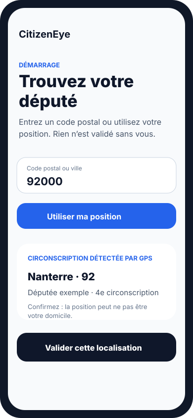
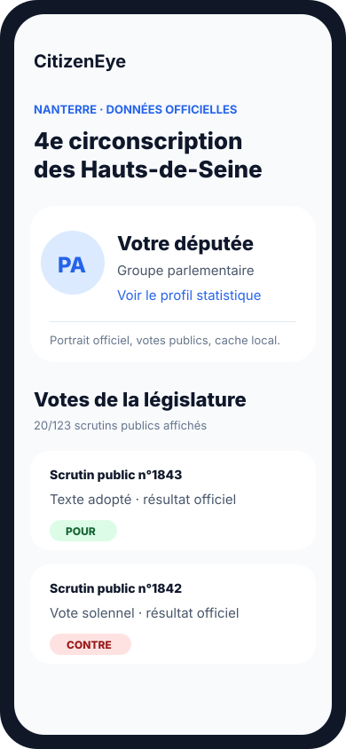
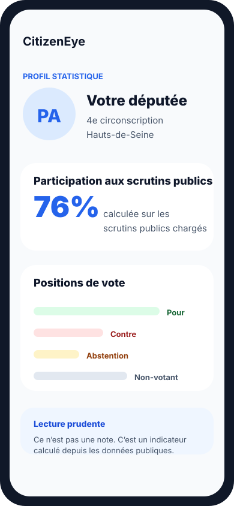

# CitizenEye

<p align="center">
  
</p>

CitizenEye est une application Android pensée pour les citoyennes et citoyens français qui veulent comprendre ce que fait leur député à l’Assemblée nationale.

L’application assume une position politique simple : le pouvoir public doit être vérifiable par tout le monde. CitizenEye n’est lié à aucun parti, campagne ou groupe parlementaire. Son but est de rendre les votes, les représentants et les données publiques lisibles sans transformer la démocratie en fil d’indignation.

## Captures d’écran

<p align="center">
  
  
  
</p>

## Pourquoi ce projet existe

La plupart des citoyens ne savent pas toujours qui les représente, comment cette personne vote, ni où vérifier l’information officielle. Les données existent, mais elles sont dispersées entre portails publics, archives volumineuses, pages institutionnelles et identifiants administratifs.

CitizenEye transforme cela en parcours simple :

1. Entrer un code postal ou utiliser la géolocalisation.
2. Confirmer la commune, le département et la circonscription détectés.
3. Voir le député qui représente cette localisation.
4. Suivre les derniers scrutins publics et la position enregistrée du député.
5. Ouvrir un profil statistique clair, calculé à partir des données publiques officielles.

L’objectif n’est pas de dire aux citoyens quoi penser. L’objectif est de rendre plus difficile le fait de cacher l’action publique derrière la complexité.

## Ce qui fonctionne aujourd’hui

CitizenEye est déjà un MVP Android connecté à de vraies données publiques, pas une démo avec données fictives.

- Application Android native en Kotlin + Jetpack Compose.
- Recherche par code postal ou ville via les données officielles des communes.
- Autocomplétion optionnelle par géolocalisation.
- Détection GPS de la circonscription par point-in-polygon sur géométrie publique.
- Confirmation explicite avant validation d’une localisation.
- Gestion des cas ambigus quand une ville ou un code postal couvre plusieurs circonscriptions.
- Chargement des députés en exercice depuis l’Open Data de l’Assemblée nationale.
- Portraits officiels arrondis des députés.
- Scrutins publics de la législature en cours depuis les données de l’Assemblée nationale, avec puces neutres pour identifier rapidement Amendement / Article / Texte complet / Motion / Budget / Résolution.
- Écran “Text and Vote Details” depuis chaque vote : explication contextualisée de la position du député, résultat détaillé, comparaison au groupe quand disponible, sources officielles séparées des ressources externes.
- Fil de votes progressif, 20 scrutins à la fois.
- Profil statistique du député :
  - participation aux scrutins publics ;
  - répartition Pour / Contre / Abstention / Non-votant ;
  - avertissement clair : ce ne sont pas des notes de performance.
- Jeu de données public compact généré par GitHub Actions et servi par GitHub Pages, sans backend hébergé.
- Téléchargement Android conditionné par `manifest.json` : l’app ne récupère les fichiers `.json.gz` versionnés que lorsque la version change.
- Repli sur cache statique existant, puis sur les archives officielles de l’Assemblée nationale si GitHub Pages est temporairement indisponible.
- Tests unitaires pour la recherche, le cache, les portraits, la pagination des votes, les statistiques et la géométrie des circonscriptions.

## Télécharger l’APK Android

Avant la disponibilité Play Store, une version de prévisualisation Android est publiée via GitHub Releases :

- APK : https://github.com/pixxelboy/citizenEye/releases/latest/download/citizeneye-preview.apk
- Notes de version : https://github.com/pixxelboy/citizenEye/releases/latest
- Empreinte SHA-256 : https://github.com/pixxelboy/citizenEye/releases/latest/download/citizeneye-preview.apk.sha256

Android peut demander d’autoriser l’installation depuis le navigateur ou le gestionnaire de fichiers, car cette version est distribuée hors Play Store. L’APK de prévisualisation utilise le package séparé `com.citizeneye.preview`, pour rester distinct de la future application Play Store.

## Soutenir le projet

CitizenEye est développé comme un outil civique indépendant. Si le projet vous semble utile, vous pouvez soutenir son développement ici : https://buymeacoffee.com/pixxelboy

## Sources open data

CitizenEye repose sur des données d’intérêt public. Les sources principales sont :

| Donnée | Source | Utilisation |
| --- | --- | --- |
| Commune, code postal, département, métadonnées INSEE | https://geo.api.gouv.fr | Parcours d’entrée par ville/code postal et libellés |
| Documentation de l’API administrative française | https://geo.api.gouv.fr/decoupage-administratif | Référence pour les recherches commune/département |
| Portail Open Data de l’Assemblée nationale | https://data.assemblee-nationale.fr | Députés, mandats, organes, scrutins publics |
| Députés actifs / mandats / organes | https://data.assemblee-nationale.fr/static/openData/repository/17/amo/deputes_actifs_mandats_actifs_organes/AMO10_deputes_actifs_mandats_actifs_organes.json.zip | Identité du député, groupe, département, circonscription |
| Scrutins et positions individuelles | https://data.assemblee-nationale.fr/static/openData/repository/17/loi/scrutins/Scrutins.json.zip | Votes publics, position enregistrée de chaque député, références de dossier législatif et séance |
| Dossiers législatifs | https://data.assemblee-nationale.fr/static/openData/repository/17/loi/dossiers_legislatifs/Dossiers_Legislatifs.json.zip | Texte parent, type de procédure, dépôt, étapes, commissions et rapporteurs quand référencés |
| Contours des circonscriptions législatives | https://static.data.gouv.fr/resources/contours-geographiques-des-circonscriptions-legislatives/20240613-191520/circonscriptions-legislatives-p10.geojson | Résolution GPS latitude/longitude vers circonscription |
| Plateforme française des données publiques | https://www.data.gouv.fr | Hébergement et provenance des jeux de données publics |

## Modèle de confiance

CitizenEye doit être utile, mais doit rester honnête.

- Un code postal seul peut être ambigu.
- Une ville peut contenir plusieurs circonscriptions législatives.
- Le GPS peut être ancien, approximatif ou correspondre au lieu de travail plutôt qu’au domicile.
- La participation aux scrutins publics n’est pas la présence physique dans l’hémicycle.
- Non-votant, abstention et absence ne doivent pas être mélangés dans une catégorie floue.
- Une note unique de type “bon député / mauvais député” serait trompeuse et partisane au mauvais sens du terme.

L’application confirme donc les localisations déduites, montre l’ambiguïté quand elle existe, nomme précisément les statistiques de scrutins publics et garde le lien avec les sources officielles là où il est utile.

## Limites actuelles

- Pas encore de compte utilisateur ni de député sauvegardé durablement.
- Pas de backend applicatif nécessaire pour le jeu de données public : GitHub Actions compile les sources officielles en JSON compact, GitHub Pages sert `manifest.json` et des fichiers `.json.gz` versionnés.
- L’app Android télécharge uniquement quand la version du manifeste change, puis conserve un repli vers le cache local et les sources officielles si la donnée statique est indisponible.
- Pas encore de notifications.
- Le GPS utilise actuellement la dernière position connue par Android ; une demande fraîche de localisation est la prochaine amélioration logique.
- La désambiguïsation adresse/rue reste nécessaire lorsque le GPS n’est pas disponible ou ne correspond pas au domicile.

## Feuille de route

Court terme :

- Sauvegarder le député sélectionné après l’entrée utilisateur.
- Ajouter une acquisition fraîche de localisation via le fused location provider.
- Ajouter un repli adresse/rue pour les communes découpées entre plusieurs circonscriptions.

Plus tard :

- Classement thématique des votes.
- Explications d’impact local.
- Notifications lors de nouveaux scrutins publics.
- Interventions, amendements, questions écrites et activité parlementaire au-delà des seuls votes publics.
- Cartes citoyennes partageables avec retour vers les sources officielles.

## Lancer le projet localement

Prérequis :

- Android Studio / Android SDK.
- JDK 17. Sur macOS, le JBR inclus dans Android Studio fonctionne.

Construire le jeu de données statique localement :

```bash
python tools/data/build_citizeneye_dataset.py --out public
```

Cela écrit `public/manifest.json` et des fichiers `deputies-*.json.gz`, `votes-*.json.gz`, `dossiers-*.json.gz` adressés par hash. Le workflow GitHub Actions publie le même dossier via GitHub Pages.

Construire et tester l’app :

```bash
JAVA_HOME="/Applications/Android Studio.app/Contents/jbr/Contents/Home" ./gradlew testDebugUnitTest assembleDebug
```

Installer sur un appareil Android connecté :

```bash
export ANDROID_HOME=/Users/romains/Library/Android/sdk
JAVA_HOME="/Applications/Android Studio.app/Contents/jbr/Contents/Home" ./gradlew installDebug
$ANDROID_HOME/platform-tools/adb shell monkey -p com.citizeneye -c android.intent.category.LAUNCHER 1
```

APK debug :

```text
app/build/outputs/apk/debug/app-debug.apk
```

## Statut du dépôt

C’est un MVP public précoce. Toute contribution doit respecter la règle centrale : être utile aux citoyens, fondée sur des preuves, et non partisane au sens des partis politiques. Une position forte pour la transparence est bienvenue ; les mécaniques d’indignation et les scores manipulateurs ne le sont pas.

---

# CitizenEye — English

CitizenEye is a citizen-first Android app that helps people in France see what their député does at the Assemblée nationale.

It is politically opinionated in one way: public power should be easy to inspect. The app is not attached to any party, campaign, or parliamentary group. It exists to make votes, representatives, and public records understandable without turning democracy into an outrage feed.

## Screenshots

<p align="center">
  
  
  
</p>

## Why this exists

Most citizens do not know who represents them, how that person votes, or where to check the official record. The data exists, but it is spread across public repositories, large archives, institutional pages, and legal identifiers.

CitizenEye turns that into a simple flow:

1. Enter a postal code or use geolocation.
2. Confirm the inferred city / department / constituency.
3. See the député who represents that place.
4. Follow recent public votes and the deputy's recorded position.
5. Open a concise statistical profile built from official public vote data.

The goal is not to tell citizens what to think. The goal is to make it harder for anyone to hide behind complexity.

## What works today

CitizenEye is already a real-data Android MVP, not a seeded demo.

- Native Android app written in Kotlin + Jetpack Compose.
- Postal-code and city lookup through official French commune data.
- Optional geolocation autocomplete.
- GPS point-in-polygon constituency detection using public constituency geometry.
- Explicit confirmation before selecting a location.
- Ambiguity handling when a city/postal code can span multiple constituencies.
- Active député loading from Assemblée nationale open data.
- Official rounded deputy portraits.
- Current-legislature public votes loaded from Assemblée nationale data, with neutral chips to identify Amendement / Article / Texte complet / Motion / Budget / Résolution at a glance.
- “Text and Vote Details” screen from every vote: contextual MP-position explanation, detailed result, group comparison when available, and official sources separated from external learning resources.
- Progressive vote feed, 20 votes at a time.
- Deputy statistical profile:
  - public-scrutin participation;
  - Pour / Contre / Abstention / Non-votant distribution;
  - clear caveat that these are not performance scores.
- Compact public dataset generated by GitHub Actions and served by GitHub Pages, with no hosted backend.
- Android manifest-based downloads: the app fetches versioned `.json.gz` files only when `manifest.json` changes.
- Fallback to stale static cache, then to official Assemblée nationale archives if GitHub Pages is temporarily unavailable.
- Unit tests for lookup, cache, deputy photos, vote pagination, stats, and constituency geometry.

## Download the Android APK

Before Play Store availability, an Android preview build is published through GitHub Releases:

- APK: https://github.com/pixxelboy/citizenEye/releases/latest/download/citizeneye-preview.apk
- Release notes: https://github.com/pixxelboy/citizenEye/releases/latest
- SHA-256 checksum: https://github.com/pixxelboy/citizenEye/releases/latest/download/citizeneye-preview.apk.sha256

Android may ask you to allow installation from your browser or file manager because this build is distributed outside the Play Store. The preview APK uses the separate package name `com.citizeneye.preview`, so it can remain distinct from the future Play Store app.

## Support the project

CitizenEye is developed as an independent civic tool. If you find it useful, you can support ongoing development here: https://buymeacoffee.com/pixxelboy

## Open data sources

CitizenEye is built on public-interest data. The important sources are:

| Data | Source | Used for |
| --- | --- | --- |
| Commune, postal code, department, INSEE metadata | https://geo.api.gouv.fr | City/postal-code onboarding and display labels |
| French administrative API documentation | https://geo.api.gouv.fr/decoupage-administratif | Source reference for commune/departement lookups |
| Assemblée nationale open data portal | https://data.assemblee-nationale.fr | Deputies, mandates, organs, public votes |
| Active deputies / mandates / organs archive | https://data.assemblee-nationale.fr/static/openData/repository/17/amo/deputes_actifs_mandats_actifs_organes/AMO10_deputes_actifs_mandats_actifs_organes.json.zip | Active deputy identity, group, department, constituency |
| Scrutins and individual vote positions | https://data.assemblee-nationale.fr/static/openData/repository/17/loi/scrutins/Scrutins.json.zip | Public votes, each deputy’s recorded position, legislative-file references, and sitting references |
| Legislative files | https://data.assemblee-nationale.fr/static/openData/repository/17/loi/dossiers_legislatifs/Dossiers_Legislatifs.json.zip | Parent text, procedure type, deposit, stages, commissions, and rapporteurs when referenced |
| Legislative constituency boundaries | https://static.data.gouv.fr/resources/contours-geographiques-des-circonscriptions-legislatives/20240613-191520/circonscriptions-legislatives-p10.geojson | GPS latitude/longitude to constituency resolution |
| French public-data platform | https://www.data.gouv.fr | Public dataset hosting and provenance |

## Trust model

CitizenEye should be useful, but it must stay honest.

- A postal code alone can be ambiguous.
- A city can contain several legislative constituencies.
- GPS can be stale, coarse, or taken from work instead of home.
- Public vote participation is not the same as physical attendance.
- Non-voting, abstention, and absence should not be collapsed into one vague label.
- A single “good deputy / bad deputy” score would be misleading and partisan in the wrong way.

So the app confirms inferred locations, shows ambiguity when needed, labels public-scrutin statistics carefully, and keeps official-source context available where it matters.

## Current limitations

- No account or persistent saved deputy yet.
- No application backend is needed for the public dataset: GitHub Actions compiles official public data into compact JSON, and GitHub Pages serves `manifest.json` plus versioned `.json.gz` files.
- The Android app downloads only when the manifest version changes, and still falls back to local static cache and official public sources if static data is temporarily unavailable.
- No notifications yet.
- GPS currently uses Android's last known location; a fresh one-shot location request is a logical next step.
- Address/street-level disambiguation is still needed when GPS is unavailable or not the user's home location.

## Roadmap

Near-term:

- Persist the selected député after onboarding.
- Add fresh one-shot location acquisition through the fused location provider.
- Add address/street-level fallback for split communes.

Later:

- Topic tagging for votes.
- Local-impact explanations.
- Notifications for new public votes.
- Deputy interventions, amendments, written questions, and parliamentary activity beyond public votes.
- Shareable civic cards that link back to official records.

## Run locally

Requirements:

- Android Studio / Android SDK.
- JDK 17. On macOS, Android Studio's bundled JBR works.

Build the static dataset locally:

```bash
python tools/data/build_citizeneye_dataset.py --out public
```

This writes `public/manifest.json` and hash-addressed `deputies-*.json.gz`, `votes-*.json.gz`, `dossiers-*.json.gz` files. GitHub Actions publishes the same directory through GitHub Pages.

Build and test the app:

```bash
JAVA_HOME="/Applications/Android Studio.app/Contents/jbr/Contents/Home" ./gradlew testDebugUnitTest assembleDebug
```

Install on an attached Android device:

```bash
export ANDROID_HOME=/Users/romains/Library/Android/sdk
JAVA_HOME="/Applications/Android Studio.app/Contents/jbr/Contents/Home" ./gradlew installDebug
$ANDROID_HOME/platform-tools/adb shell monkey -p com.citizeneye -c android.intent.category.LAUNCHER 1
```

Debug APK:

```text
app/build/outputs/apk/debug/app-debug.apk
```

## Repository status

This is an early public MVP. Contributions should preserve the core rule: be citizen-friendly, evidence-based, and non-partisan in party terms. Strong pro-transparency stance is welcome; manipulative scoring and outrage mechanics are not.
